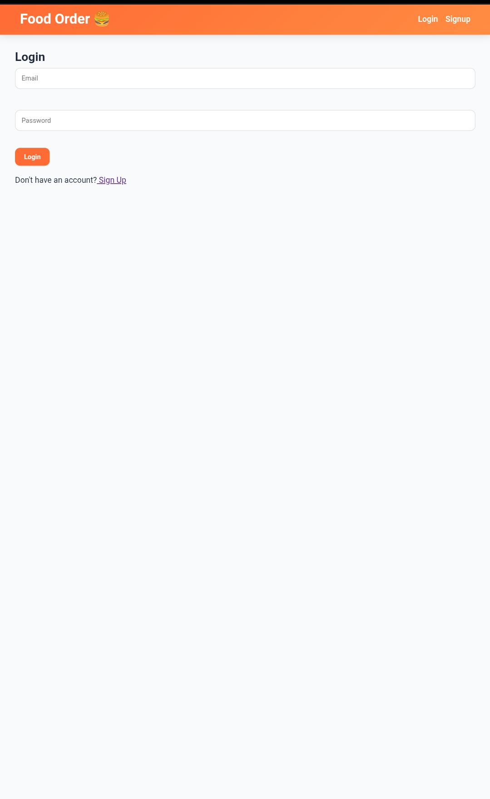
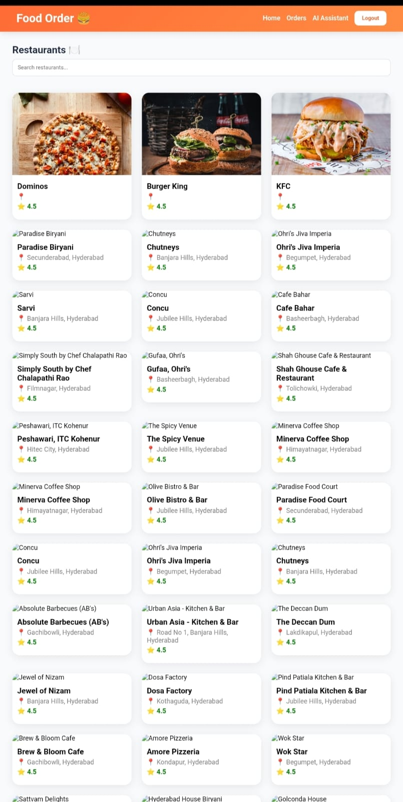
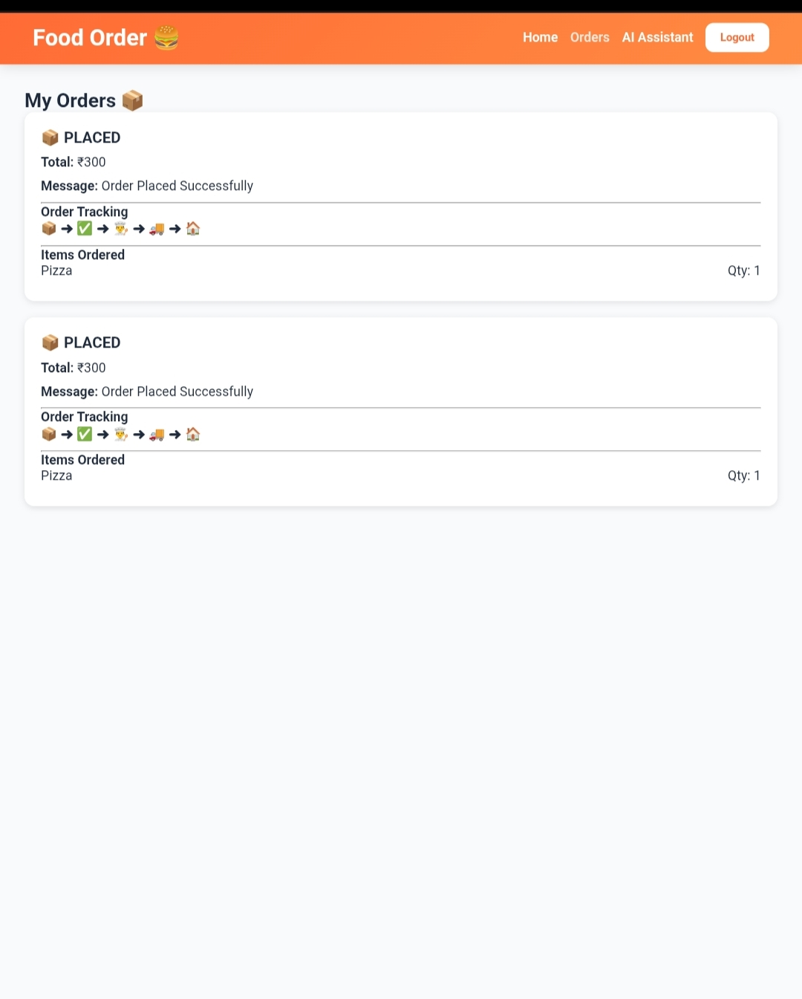
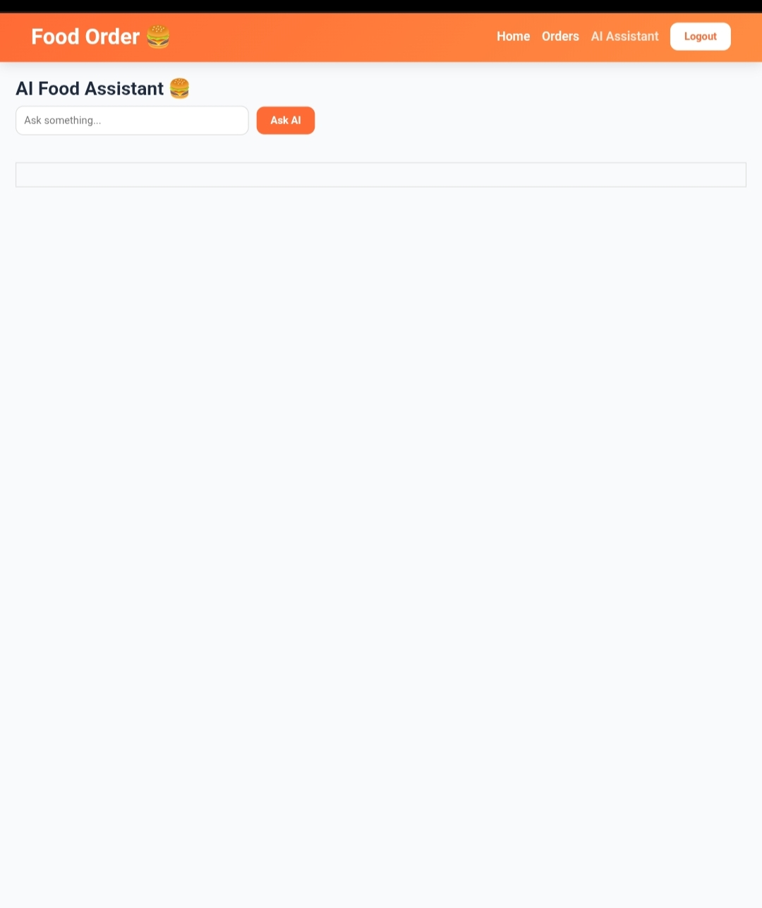
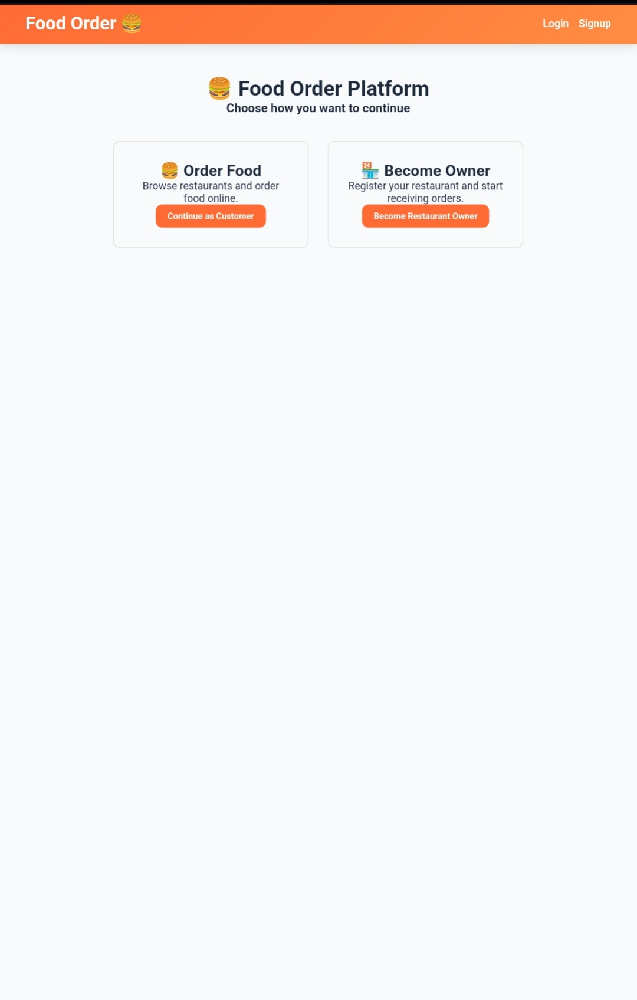

#  AI Food Ordering Platform

A full-stack MERN Food Ordering Platform with AI-powered food recommendations using Google Gemini AI.

##  Live Demo

Frontend: https://food-order-8qe3.vercel.app

Backend: https://food-order-eyxp.onrender.com

---

##  Features

###  Customer

* User Registration & Login
* Browse Restaurants
* Search Food Items
* Add to Cart
* Place Orders
* Track Order Status
* AI Food Recommendations
* Become Restaurant Owner

###  Restaurant Owner

* Apply for Restaurant Ownership
* Admin Approval System
* Restaurant Dashboard
* Add Food Items
* Manage Restaurant Menu
* Receive Orders
* Update Order Status

###  Admin

* Dashboard Statistics
* Approve Restaurant Owners
* Generate Restaurants using AI
* Monitor Platform Activity
* Manage Restaurants

###  AI Features

* Food Recommendations
* Budget-based Suggestions
* Restaurant Suggestions
* Similar Food Suggestions when item is unavailable
* Google Gemini AI Integration

---

##  Tech Stack

### Frontend

* React.js
* React Router DOM
* Axios
* CSS

### Backend

* Node.js
* Express.js
* JWT Authentication

### Database

* MongoDB Atlas
* Mongoose

### AI

* Google Gemini API

### Deployment

* Vercel
* Render

---

##  Screenshots

### Login Page

### Home Page

### Orders Page

### AI Assistant

### Landing Page

---

##  Project Structure

FOOD_ORDER

├── backend

├── frontend

├── screenshots

├── README.md

└── package.json

---

##  Author

Laxmikant Yadav

GitHub: https://github.com/kanthyadav

LinkedIn: https://linkedin.com/in/laxmikant-yadav-b4443825a
